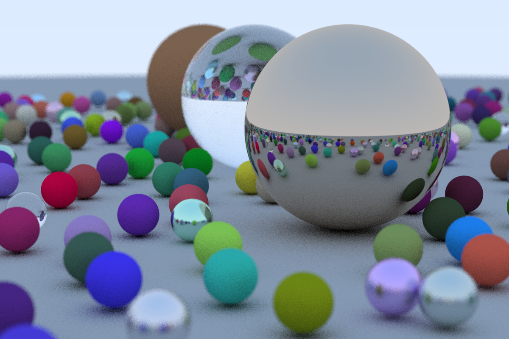

# Raytracing in a Weekend

This is my take on the raytracing in a weekend book.

## Todo:

1. Add new shapes
2. Add Lightning
3. Optimize and enhance code abstraction

## Results

The result can be better show with images:



The timings are compared using a 8-core 16GB RAM machine.

Time to render with 8 threads:
```
real   1m37,361s
user   12m8,417s
sys    0m2,998s
```

Time to render with 16 threads:
```
real   1m36,147s
user   12m18,307s
sys    0m3,455s
```

Samples: 40<br/><br/>
Resolution: 1200 x 800<br/><br/>


Time to render using 80 samples:
```
real   3m17,446s
user   24m25,594s
sys    0m3,545s
```
